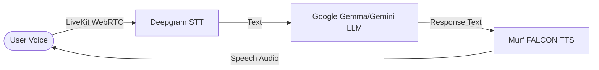

# How to Run the Murf LiveKit Voice Agent

Quick reference guide for running the application after setup.

> **Important**: Make sure your terminal is inside the repository folder: `cd murf-livekit-starter`

---

## 🚀 Quick Run (Windows / PowerShell)

### Method 1: Separate Terminals (Recommended to view live logs)

**Terminal 1 — Backend Agent**:
```powershell
cd E:\Murf\murf-livekit-starter\backend
$env:PATH += ";$env:USERPROFILE\.local\bin"
uv run python src/agent.py dev
```

**Terminal 2 — Frontend UI**:
```powershell
cd E:\Murf\murf-livekit-starter\frontend
pnpm dev
```

---

### Method 2: One-Line PowerShell Command (from project root)

```powershell
cd E:\Murf\murf-livekit-starter; $env:PATH += ";$env:USERPROFILE\.local\bin"; .\start_app.ps1
```

---

### 🐧 macOS / Linux

#### Method 1: Separate Terminals

**Terminal 1 — Backend Agent**:

```bash
cd backend
uv run python src/agent.py dev
```

**Terminal 2 — Frontend UI**:

```bash
cd frontend
pnpm dev
```

#### Method 2: All-in-One Script (from repo root)

```bash
chmod +x start_app.sh
./start_app.sh
```

---

## 🌐 Accessing the Application

Open your browser and navigate to:  
👉 **[http://localhost:3000](http://localhost:3000)**

1. Click **Start talking**.
2. Allow microphone access.
3. Speak into your microphone — the agent will respond using **Murf Falcon TTS (Anisha)**!

---

## 🏗 Project Architecture & Pipeline



---

## 🔑 APIs Used in This Project

1. **Google Gemini / Gemma API** (`google.LLM`)
   - **Role:** Brain (LLM) — Processes user query and generates intelligent text responses.
   - **Configured Model:** `gemma-4-26b-a4b-it` (in `backend/src/agent.py`)
   - **API Key:** `GOOGLE_API_KEY` in `backend/.env.local`

2. **Murf AI API** (`murf.TTS`)
   - **Role:** Voice (TTS) — Converts text responses to life-like audio.
   - **Configured Voice:** `en-IN-anisha`, style: `Conversation`, model: `FALCON`
   - **API Key:** `MURF_API_KEY` in `backend/.env.local`

3. **Deepgram API** (`deepgram.STT`)
   - **Role:** Ears (STT) — Transcribes live user microphone audio into text.
   - **Configured Model:** `nova-3`
   - **API Key:** `DEEPGRAM_API_KEY` in `backend/.env.local`

4. **LiveKit Cloud API**
   - **Role:** Real-time WebRTC infrastructure between frontend browser & backend Python agent.
   - **Credentials:** `LIVEKIT_URL`, `LIVEKIT_API_KEY`, `LIVEKIT_API_SECRET` in `backend/.env.local`

---

## 🤖 Google Gemma / Gemini LLM Guide

### Code Integration in `agent.py`

In `backend/src/agent.py`:

```python
llm=google.LLM(
    model="gemma-4-26b-a4b-it", # Configured model
)
```

### How to Get your Free Google API Key

1. Go to [Google AI Studio](https://aistudio.google.com/app/apikey).
2. Sign in with your Google account.
3. Click **"Create API key"**.
4. Add the key to `backend/.env.local`:
   ```env
   GOOGLE_API_KEY=your_actual_key_here
   ```

### Switchable Models in `agent.py`

| Model Name             | Key Advantage                                       |
| :--------------------- | :-------------------------------------------------- |
| `"gemma-4-26b-a4b-it"` | Google open weights Gemma model (currently set)     |
| `"gemini-2.5-flash"`   | Ultra-fast low latency (Recommended for live voice) |
| `"gemini-2.5-pro"`     | High reasoning capability for complex prompts       |

---

## 💡 How to Use Free Gemma APIs (General Reference)

### Option 1: Google AI Studio (Official Free Tier)

- **SDK:** `google-genai`
- **Python Usage:**

  ```python
  import os
  from google import genai

  client = genai.Client(api_key=os.environ.get("GEMINI_API_KEY"))
  response = client.models.generate_content(
      model="gemma-2-9b-it",
      contents="Explain quantum computing simply."
  )
  print(response.text)
  ```

### Option 2: Groq Cloud (Ultra-Fast Free Tier)

- **SDK:** `groq` (OpenAI compatible)
- **Python Usage:**

  ```python
  import os
  from groq import Groq

  client = Groq(api_key=os.environ.get("GROQ_API_KEY"))
  completion = client.chat.completions.create(
      model="gemma2-9b-it",
      messages=[{"role": "user", "content": "Write a short poem."}]
  )
  print(completion.choices[0].message.content)
  ```

### Option 3: Ollama (100% Free & Local)

- **Command:** `ollama run gemma2:2b`
- **Python Usage:**
  ```python
  import requests
  res = requests.post("http://localhost:11434/api/generate", json={
      "model": "gemma2:2b",
      "prompt": "Hello Gemma!",
      "stream": False
  })
  print(res.json()["response"])
  ```
